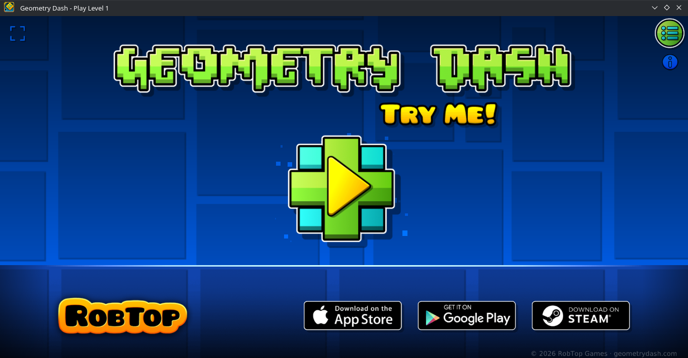

# GD-WEB-RECOMP — Geometry Dash Web Native C++ Port

<p align="center">
  
</p>

> # ⚠️ **Warning:** This project uses AI.
> Some people may not like AI at all for any purpose. If so, just ignore this project. Do not hate on it. I personally believe using AI for both decompilation and porting the entire engine to C++ is a completely valid use case, as doing either of these entirely by hand would take forever.

---

## 🎮 What is this project?

This repository contains two major milestones:
1. **The clean, reverse-engineered deobfuscation** of the official Geometry Dash web demo found on [geometrydash.com](https://geometrydash.com) (originally built on Phaser 3.90.0).
2. **A 100% standalone, lightweight native C++ port** built from scratch with a custom multi-backend rendering architecture (**OpenGL 1.1**, **DirectX 8**, and **DirectX 9**) over **SDL2**, engineered to replicate the exact look, feel, and mechanics of the original release **1:1**, while maximizing framerate and minimizing latency on ancient low-end hardware (such as legacy netbooks, school laptops, and Intel Atom / GMA graphics).

---

## ⚡ The Native C++ Multi-Backend Engine

A lightweight 1:1 C++ port replacing browser runtimes with a custom hardware abstraction layer (`RenderDevice`):

### Key Features
* **Multi-Backend Rendering:** Native **DirectX 8** (32-bit Intel Atom/GMA FastPath), **DirectX 9** (64-bit Windows), and **OpenGL 1.1** (Linux & fallback).
* **Intel Atom / GMA Optimization:** Pre-transformed 2D vertices (`D3DFVF_XYZRHW`) and dynamic buffers (`D3DLOCK_DISCARD`) bypass GPU vertex-processing bottlenecks on vintage Intel GMA 950/3150 hardware.
* **100% Static Standalone Binary:** Linked with `-static -static-libgcc -static-libstdc++`; zero external DLL dependencies in `build/`.
* **Automated Asset Sync:** Scans `assets/` via C++17 `std::filesystem` to index textures (`.png`) and parse BMFont files (`.fnt`).
* **Native Audio & Level Decompression:** Replaces Pako.js with system `zlib`; background music streaming and zero-latency SFX powered by `miniaudio` and `stb_vorbis`.

---

## 🖥️ Platform-Aware Settings & In-Game Selectors

The in-game user interface adapts dynamically depending on the operating system and binary architecture:

* **Main Menu UI:** Dedicated **Settings** button in the top-right corner; **Info / Credits** button located directly below it.
* **Configurable FPS Limiter:** Integrated in-game framerate limiter available in the Settings menu.
* **Conditional In-Game Renderer Selector:**
  * **Linux:** Hidden automatically (defaults exclusively to native OpenGL 1.1).
  * **Windows 64-bit:** Exposes **DirectX 9** and **OpenGL 1.1** (hides DirectX 8, which is unavailable in 64-bit Windows).
  * **Windows 32-bit:** Exposes **DirectX 8**, **DirectX 9**, and **OpenGL 1.1** (full manual control for vintage netbooks).

---

## 🛠️ Building & Running

### 1. Native Linux Build

#### Prerequisites
```bash
# Arch Linux / CachyOS / Manjaro
sudo pacman -S base-devel sdl2 mesa zlib

# Ubuntu / Debian / Linux Mint
sudo apt install build-essential libsdl2-dev libgl1-mesa-dev zlib1g-dev
```

#### Compile & Run
```bash
# Clean and compile with all CPU cores
make -j$(nproc)

# Launch
./build/GeometryDash
```

---

### 2. Cross-Compiling for Windows from Linux

You can compile standalone Windows executables (both 32-bit and 64-bit) directly from Linux using MinGW-w64. The build scripts statically link all runtimes (`libgcc`, `libstdc++`, `zlib`, and `SDL2`), resulting in completely portable executables with **zero external DLL requirements**.

#### Prerequisites
```bash
# Arch Linux / CachyOS / Manjaro
sudo pacman -S base-devel mingw-w64-gcc make

# Ubuntu / Debian / Linux Mint
sudo apt install build-essential g++-mingw-w64-i686 g++-mingw-w64-x86-64 mingw-w64-tools make

# Fedora
sudo dnf install mingw32-gcc-c++ mingw64-gcc-c++ mingw32-binutils mingw64-binutils make
```

#### Compile Commands
* **Windows 32-bit (x86)** *(Recommended for legacy Intel Atom netbooks / GMA graphics with Direct3D 8)*:
  ```bash
  make win32
  # or directly:
  ./build_win32.sh
  ```
  *Produces `build/GeometryDash.exe` (PE32 Intel i386).*

* **Windows 64-bit (x64)** *(Recommended for modern 64-bit Windows with Direct3D 9)*:
  ```bash
  make win64
  # or directly:
  ./build_win64.sh
  ```
  *Produces `build/GeometryDash_x64.exe` (PE32+ x86-64).*

---

### 3. Native Windows Build (MSYS2)

If building directly on Windows:

1. Install **[MSYS2](https://www.msys2.org/)**.
2. Open the appropriate terminal:

#### For 32-bit (open **MSYS2 MINGW32** terminal):
```bash
pacman -S --needed base-devel mingw-w64-i686-toolchain mingw-w64-i686-SDL2 mingw-w64-i686-zlib make
make
```

#### For 64-bit (open **MSYS2 MINGW64** terminal):
```bash
pacman -S --needed base-devel mingw-w64-x86_64-toolchain mingw-w64-x86_64-SDL2 mingw-w64-x86_64-zlib make
make
```

---

### 📦 Standalone Portable Distribution

To distribute the game on any Windows PC (no installer or dependencies needed), simply copy the `build/` folder:

```text
build/
├── GeometryDash.exe        <- 32-bit standalone binary (Direct3D 8 / Direct3D 9 / OpenGL 1.1)
├── GeometryDash_x64.exe    <- 64-bit standalone binary (Direct3D 9 / OpenGL 1.1)
├── settings.cfg            <- Configuration (volume, FPS cap, renderer selection)
└── assets/                 <- Game assets (textures, fonts, audio, levels)
```

> **Note:** Both executables are completely standalone and do not require `SDL2.dll` or any C++ runtime redistributable. Direct3D 8, Direct3D 9, and OpenGL 1.1 are resolved dynamically via native Windows system drivers.

---

### Command-Line Renderer Flags
You can explicitly override the default graphics backend by passing flags via terminal or Windows shortcut targets:

| Flag | Target Backend | Supported Architectures |
| :--- | :--- | :--- |
| `-dx8` / `-d3d8` | **DirectX 8 (GMA FastPath)** | Windows 32-bit |
| `-dx9` / `-d3d9` | **DirectX 9 (FastPath)** | Windows 32-bit & 64-bit |
| `-opengl` / `-gl` | **OpenGL 1.1** | Linux, Windows 32-bit & 64-bit |

*Example:*
```bash
./build/GeometryDash.exe -dx8
```

---

## 🔧 Texture & Asset Tools

### Spritesheet Patcher (`tools/spritesheet_patcher.py`)
A specialized asset pipeline utility used to uncompress and restore original graphic fidelity to the game's spritesheet atlas (`GJ_WebSheet.png` and `GJ_WebSheet.json`).

The official browser release came with heavily compressed, blurry, and lossy textures. This script resolves that issue:
* **Original Asset Extraction (GD 2.2 and earlier):** Reads original resources from any Geometry Dash version (2.2 or any earlier update), extracting pristine, uncompressed sprites directly from Cocos2d `.plist` files or loose HD/UHD `.png` files.
* **Exact Atlas Repacking:** Matches each sprite to its corresponding record in `GJ_WebSheet.json`, calculates the original source size, trims transparent padding, downsamples with Lanczos filtering to the web SD baseline, and pastes the clean texture in the exact pixel position where it belongs in the spritesheet.
* **Visual Quality Restored:** Over-compression artifacts on portals, rings, pads, spikes, and UI elements are completely eliminated, making the game look clean and crisp without changing sprite layouts.
* **Custom Skin Injections:** Allows overriding default skins (e.g. replacing the default player cube with alternative icons).

#### Requirements & Usage
```bash
# Install Pillow dependency
pip install Pillow

# Run the patcher
python3 tools/spritesheet_patcher.py
```
Output files are exported to `Generated_Files/` (`GJ_WebSheet.png` and `GJ_WebSheet.json`), ready to replace the textures in `assets/`.

---

## 📁 Repository Structure

```text
├── assets/                       # Spritesheets, audio, bitmap fonts, and level files
│   ├── banner.png                # Project banner
│   ├── GJ_WebSheet.png
│   ├── GJ_WebSheet.json
│   ├── 1.txt                     # Stereo Madness level data
│   ├── StereoMadness.mp3
│   └── *.ogg                     # Sound effects (explode_11, playSound_01, etc.)
│
├── tools/                        # Utility and asset pipeline scripts
│   └── spritesheet_patcher.py    # Spritesheet & texture atlas rebuild/injection tool
│
├── src/                          # Native C++ Engine (SDL2 Multi-Backend)
│   ├── main.cpp                  # Entry point, architecture detection & precision frame pacing
│   ├── constants.h               # Shared physics constants, sub-stepping & blend synchronization
│   ├── render-device.h / .cpp    # Unified graphics abstraction, OpenGL 1.1 & DirectX 9 backends
│   ├── render-d3d8.cpp           # Isolated DirectX 8 FastPath backend (Win32 GMA)
│   ├── boot-scene.h / .cpp       # Asset preloader & texture catalog management
│   ├── font-helpers.h / .cpp     # BMFont (.fnt) parser & batched bitmap font renderer
│   ├── player-physics-state.h    # State machine (velocity, grounded, ship mode)
│   ├── level-data-helpers.h/.cpp # Atlas frame lookup, scale-9 and quad batching abstractions
│   ├── pako-compression.h / .cpp # Native zlib level parser & object catalog
│   ├── level-renderer.h / .cpp   # Infinite carousel ground & spatial section batching
│   ├── trail-renderer.h / .cpp   # Additive motion trail ribbon for ship mode
│   ├── sprite-layer-helper.h/.cpp# Multi-layer sprite depth/tint helper
│   ├── player.h / .cpp           # Cube/Ship controller, rotation & shard death explosion system
│   ├── tween-value.h             # Color interpolation (Tween) engine
│   ├── color-manager.h / .cpp    # Background and ground color trigger transitions
│   ├── audio-manager.h / .cpp    # Music playback, volume fading & audio-beat metering
│   ├── game-scene.h / .cpp       # Main game loop, camera tracking, HUD, settings & pause overlays
│   ├── win-effects.h / .cpp      # Expanding shockwave rings & win celebration effects
│   ├── stb_image.h               # Public domain PNG image loader
│   ├── stb_vorbis.c              # Public domain OGG Vorbis decoder (for SFX)
│   └── miniaudio.h               # Lightweight audio playback library
│
├── build_win32.sh                # Automated 32-bit Windows MinGW cross-compiler script
├── build_win64.sh                # Automated 64-bit Windows MinGW cross-compiler script
└── Makefile                      # Incremental native build system with static linking rules
```

---

## 📜 History: The JavaScript Deobfuscation

The web version on `geometrydash.com` originally shipped as a single minified and obfuscated 56,000-line bundle (`index-game.js`). 

The initial phase of this project accomplished:
1. **Vendor Separation:** Isolating the unmodified official `phaser.min.js` (3.90.0) build from the actual game logic.
2. **Deobfuscation:** Resolving ~40,000 hex lookup calls (`_0x4e0e(...)`) into human-readable strings, method identifiers, and property keys.
3. **Dead-Code Elimination:** Stripping out leftover decoder tables, arrays, and dead execution branches.
4. **Scope-Aware Renaming:** Utilizing Babel AST traversals to rename obfuscated variables into semantically meaningful identifiers based on assignments and callback signatures.
5. **Modular Decomposition:** Splitting the monolithic script into 16 clean, Prettier-formatted ES files under `src/`.

---

## 🤝 Credits & Acknowledgements

* **RobTop Games:** Creator of Geometry Dash.
* **Phaser Studio:** Developers of the Phaser HTML5 game engine.
* **Original Decompilation Contributors:** For the initial extraction and reverse-engineering of the browser bundle.
* **stb & miniaudio contributors:** For providing the rock-solid single-header C libraries (`stb_image`, `stb_vorbis`, and `miniaudio`) powering texture loading and multi-format audio playback.
